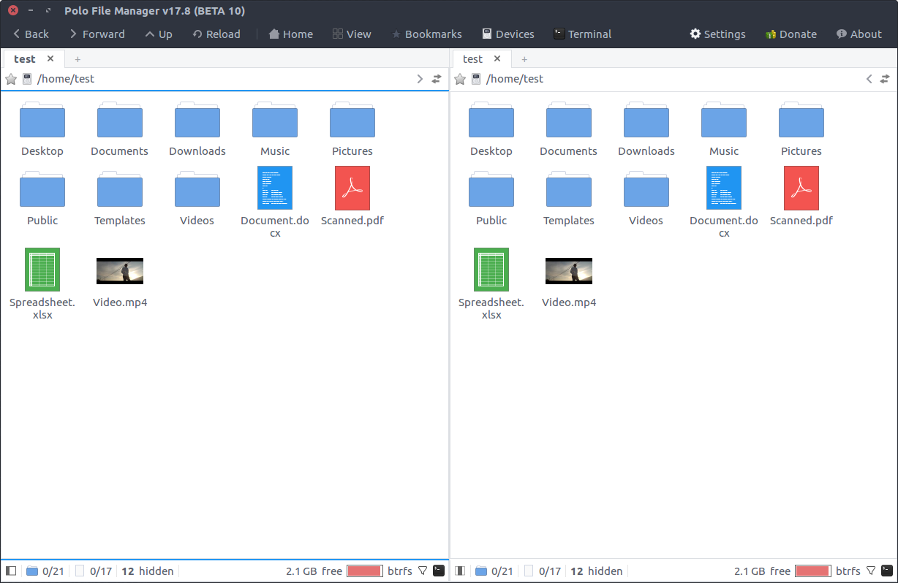
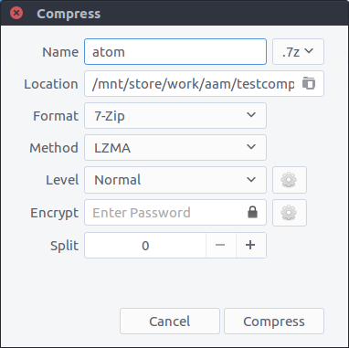
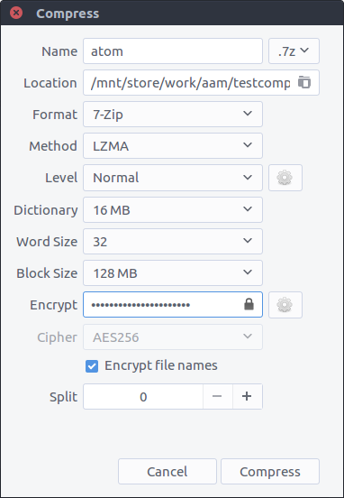
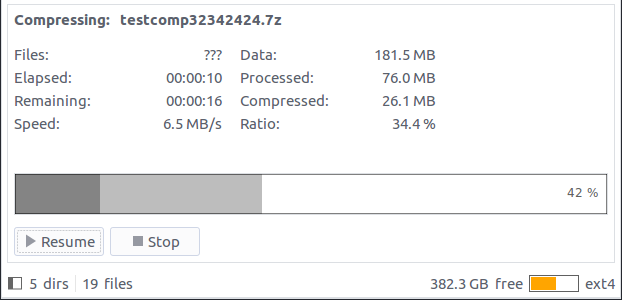
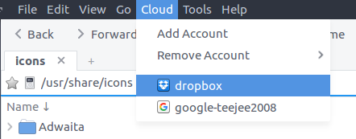

### this a fork from https://github.com/teejee2008/polo

## Polo File Manager

Polo is a modern, light-weight file manager for Linux with support for multiple
panes and tabs; support for archives, and much more.

## **Features**

- **Multiple Panes** - Single-pane, dual-pane (vertical or horizontal split) and
  quad-pane layouts. Supports multiple tabs in each pane. Each tab has an
  embedded terminal which can be toggled with the F4 key.
- **Multiple Views** - List view, Icon view, Tiled view and Media view.
- **Device Manager** - Devices popup displays list of connected devices with
  options to mount and unmount. Supports locking/unlocking LUKS encrypted
  devices.
- **Archive Support** - Support for browsing archives as normal folders.
  Supports creation of archives in multiple formats with advanced compression
  settings.
- **PDF Actions** - Actions in right-click menu: Split and Merge pages, Add or
  Remove Password, Rotate, etc.
- **ISO Actions** - Actions in right-click menu: Mount, Boot in VM, Write to USB
- **Image Actions** - Actions in right-click menu: Rotate, Resize, Reduce
  Quality, Optimize PNG, Convert to other formats, Boot or Reduce Colors, etc.
- **Checksum & Hashing** - Actions in right-click menu to generate MD5, SHA1,
  SHA2-256 ad SHA2-512 checksums for file and folders. Double-click on files
  with **.md5, .sha1, .sha2, .sha256, .sha512** extensions to verify.
- **Video Downloads** - Paste URLs from YouTube and other video websites in a
  folder to download video files. Integrates with youtube-dl utility.

## Screenshots

_Single-pane layout with Sidebar and IconView_

_Single-pane layout with Sidebar and ListView_

_Dual-pane layout with IconView_

_Dual-pane layout with ListView_

_Options for creating archives - Supports all encoder options, encryption, and
split archives_

_Support for browsing cloud storage accounts_

## Installation

PPA and DEB files are available for Ubuntu and Ubuntu-based distributions.
Binary installers are available for all Linux distributions.

**[Installation](https://github.com/teejee2008/polo/wiki/Installation)**
